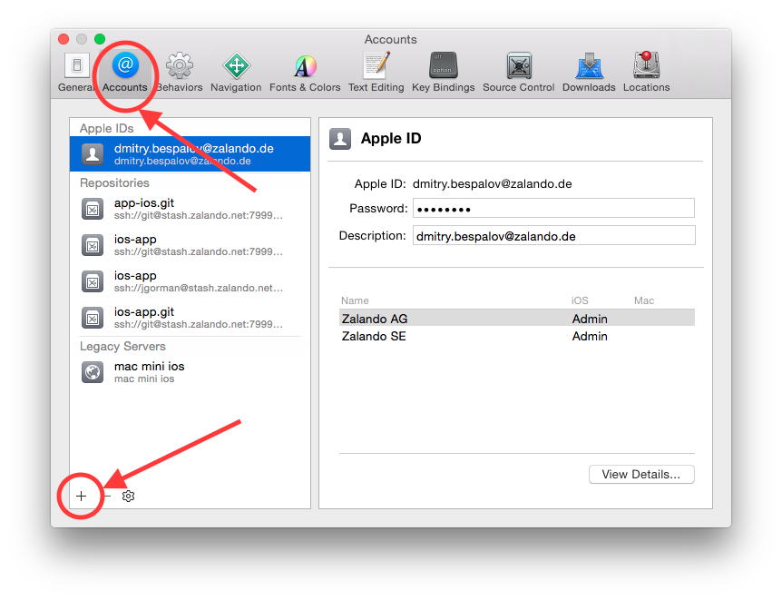
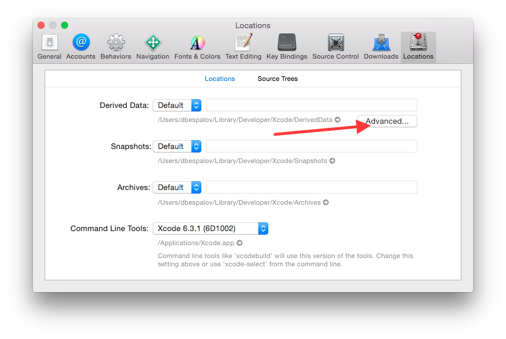
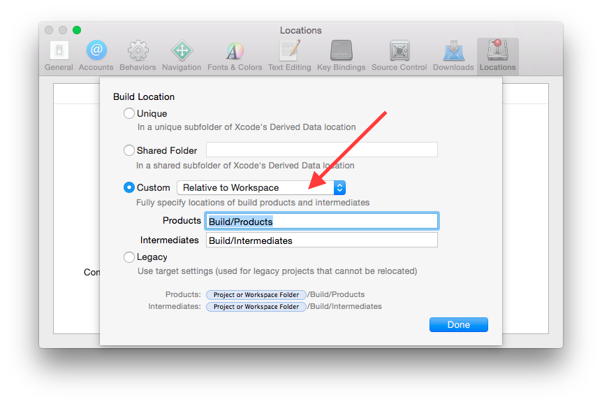
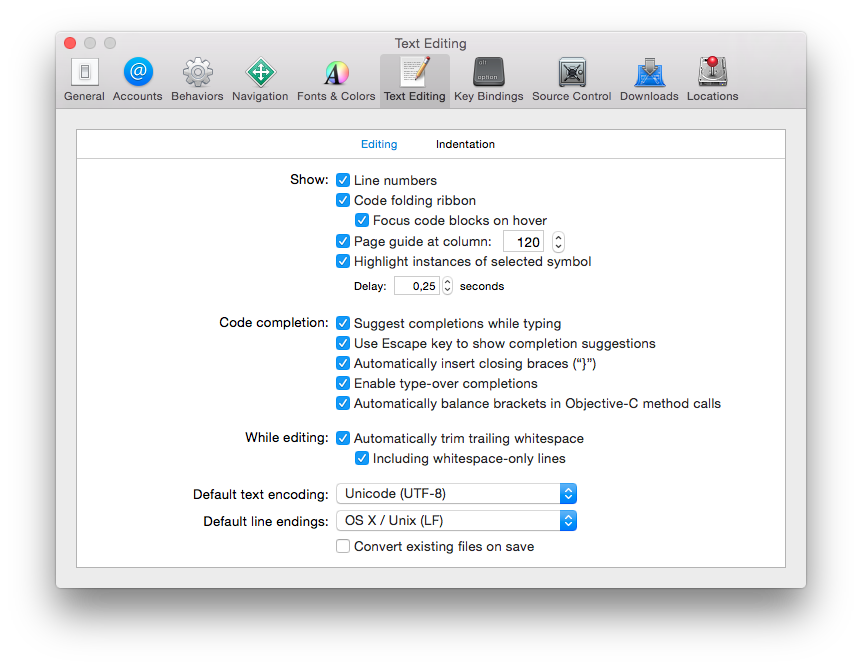
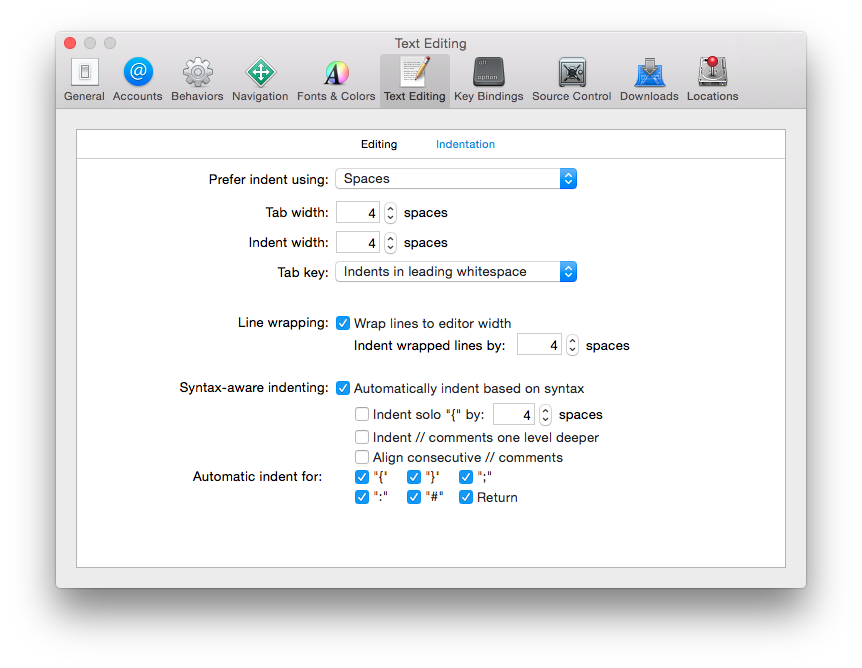
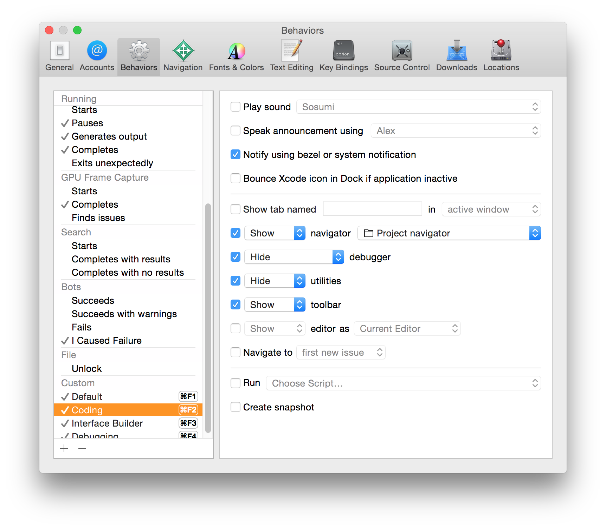
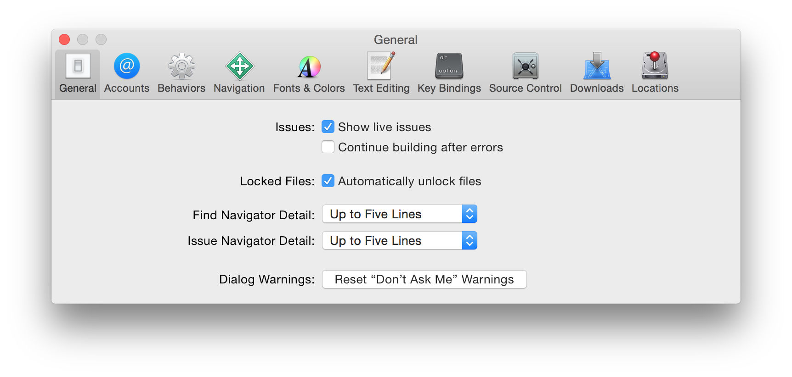

# Getting Started
## Apple ID and iOS Developer Program
Please create an [Apple ID](https://appleid.apple.com) with your company email. After that we will add you to our development team.

## Xcode
After you have received and confirmed invitation for Zalando iOS Developer Program, add your account to Xcode in Preferences.



Make sure you change setting Build Products Location to Relative to Workspace in order to avoid "invalid module cache" errors.





We use the following Editing and Indentation settings





You can configure Xcode behaviors for different modes of work



It is good to increase default number of lines for issue navigator:



There are many plugins for Xcode that can make your programming life more enjoyable. To easily install them, download [Alcatraz](https://github.com/supermarin/Alcatraz). Try out `FuzzyAutocomplete`! Among others, the following plugins are worth mentioning:

* Polychromatic
* BBUToyUnboxing
* BlockJump
* GitDiff
* KKHighlightRecentPlugin
* MCLog
* VVDocumenter-Xcode
* XcodeColors

Optionally:

* AdjustFontSize (for presentations)
* Backlight
* OROpenInAppCode


## Git and SSH Keys

Generate your ssh keys:

```
$ ssh-keygen -t rsa
```

Copy your key to clipboard and add it to your Stash account.

```
$ cat ~/.ssh/id_rsa.pub | pbcopy
```

Please configure your git with your information

```
$ git config --global user.name "John Appleseed"
$ git config --global user.email "john.appleseed@zalando.de"
$ git config --global push.default upstream
```

Now you are ready to checkout the project:

```
$ mkdir ~/Projects
$ cd Projects
$ git clone ssh://git@stash.zalando.net:7999/shop-mobile/ios-app.git
$ cd ios-app
```
## Homebrew
We use [Homebrew](http://brew.sh) for easy installation of missing packages, you might want to install that, too:

```
$ ruby -e "$(curl -fsSL https://raw.githubusercontent.com/Homebrew/install/master/install)"
```

## Ruby 
Prefer installing Ruby through [rbenv](https://github.com/sstephenson/rbenv). It makes  handling of different Ruby versions in the system a breeze.

```
$ brew update
$ brew install rbenv ruby-build rbenv-bundler
```
Add `eval "$(rbenv init -)"` to your shell's profile (`.bash_profile`, `.zprofile`)

Now, let's install Ruby:

```
$ rbenv install 2.1.4
```
## Cocoapods

You'll need to install [Bundler](http://bundler.io) gem to proceed with other installations.

```
$ gem install bundler
```

We use [Cocoapods](http://cocoapods.org) for most of our external dependencies. Only add a dependency as static library when there’s no other option available. The `Podfile.lock` file and the pods themselves file are not versioned since this creates unnecessary merge conflicts. Instead, only ever insert or update pods with a *fixed* version number and run `pod install` on a regular basis.

To install Cocoapods, run `bundle` from the project root:

```
$ cd Projects/ios-app
$ bundle
```

The final step is setting up the Cocoapods local repositories:

```
$ pod setup
```

## xUnique
* We use [xUnique](https://github.com/truebit/xUnique) script to make merging  changes in `.xcodeproj` file easier. The script will sort the project structure and generate unique identifiers for all project files and groups. To install xUnique:

```
$ brew install python
$ pip install xUnique

Alternatively, if you want to use system python:
$ sudo easy_install xUnique

Add xUnique to pre-commit hook file (.git/hooks/pre-commit):

#!/bin/sh
python -mxUnique -c zalando.xcodeproj

$ chmod +x .git/hooks/pre-commit
```

## Workflow
We use [Gitflow](https://www.atlassian.com/git/tutorials/comparing-workflows/gitflow-workflow) workflow:

* `develop` branch is a main development branch
* `master` branch contains 'historical' commits, another words we use it to keep released versions of the app
* When starting work on a ticket, create `feature/ZEOS-TICKET_NUMBER-short-description` branch from `develop`

```
$ git checkout develop -b feature/ZEOS-23864-change-background
```

* When you have done your work and want to publish your changes, create a pull-request in Stash to `develop` branch.
* Don't forget to check `Delete source branch` in Stash when merging your branch to develop
* When we want to release the app, we create `release/version_number` branch. 
    * All the bug fixes and features added to release branch should have branch name `feature/ZEOS-TICKET_NUMBER-short-description`
* When the app is released, we merge `release` branch to `develop` and `master`
* Released version of the app in `master` branch is tagged with version number:

```
$ git tag -a marketing_version-build_version
```
* If, after release we find critical bugs and decide to submit another version of the app, we create a `hotfix/version_number` branch from `master`. 
    * All the branches for `hotfix` branch should have name `bugfix/ZEOS-TICKET_NUMBER-short-description`


It is convenient to use hook to add a ticket number into your commit message to avoid typing it all the time. It should be put in `.git/hooks/commit-msg`:

```
#!/bin/sh

TICKET=`git symbolic-ref HEAD | sed -E 's:.*/([A-Z]+-[0-9]+)*.*:\1:'`

test -z "$TICKET" && exit 0
head -1 "$1" | grep -q "$TICKET" && exit 0

echo -n "$TICKET " > "$1.msg"
cat "$1" >> "$1.msg"
mv "$1.msg" "$1"
```

## Versioning
Our project uses semantic versioning for build versions, so make sure you understand it. [http://semver.org/](http://semver.org/)

Example versions:
``` 
Marketing version: 3.6
Build version: 17.4.1
```

To bump version, we have a `toolbelt` tool that is installed as part of `bundle install`ation

```
$ toolbelt version -p minor -w version
$ toolbelt version -p minor -w marketing
```


## Appstore Submission
Before building the version of the app for AppStore distribution, make sure you have all necessary certificates and provisioning profiles installed on your system. 

To build the version manually through Xcode UI, you can use a helper command that will setup project's code sign identities and provisioning profiles:

```
$ ./build.rb -p release
```

If you want to build `ipa` completely from command line, use the following:

```
$ brew install xctool # if you don't have it
$ ./build.rb --staging appstore
```

You will find build results in `export` directory.